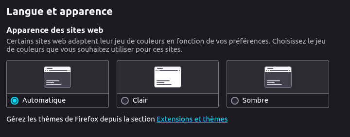

# nigol

# technique

1. nextJS
1. base mongodb sur docker
1. bcrypt pour le cryptage du mot de passe
1. axios pour les requette api
1. jwt pour les token web

# phase projet

1. [phase 0](#phase-0)
    1. [setup environnement](#setup-environnement)
    1. [chartre graphique](#chartre-graphique)
    1. [classe graphique de base](#classe-graphique-de-base)
    1. [theme changement](#theme-changement)
1. [phase 1](#phase-1)


# phase 0

avant de coder

## setup environnement

1. create nextjs app

   ```sh
   npx create-next-app 3-nigol@latest
   ```

   choisir les options :

   - typescript
   - tailwind
   - Eslint
   - src directory
   - app router

   

1. create directories

| route                          | function           | s     |
| ------------------------------ | ------------------ | ----- |
| /src/app/api/users/login       | login              | api   |
| /src/app/api/users/logout      | logout             | api   |
| /src/app/api/users/me          | my profile         | api   |
| /src/app/api/users/signup      | subscribe          | api   |
| /src/app/api/users/verifyEmail | check mail         | api   |
| /src/app/login                 | login              | page  |
| /src/app/logout                | logout             | page  |
| /src/app/profile/[id]/         | my profile         | page  |
| /src/app/signup                | subscribe          | page  |
| /src/app/verifyEmal            | check mail         | page  |
| /src/app/                      | home               | page  |
| /src/db/                       | database           | utils |
| /src/helpers/                  | helpers            | utils |
| /src/middleware.ts             | route management   | utils |
| /src/components                | composant commun   | utils |
| /src/common                    | constant + typDef  | utils |
| /src/container                 | multiple component | utils |
| /src/action                    | utilities          | utils |
| /src/database                  | utilities db       | utils |
| /src/hook                      | utilities          | utils |
| /src/service                   | utilities          | utils |
| /src/store                     | utilities          | utils |
| /src/styles                    | utilities          | utils |

1. create .env

- create . env +
- env.save +
- entry in .gitignore

1. create github repositorie

1. install package
1. push init to github
1. change page title

## chartre graphique

1.  Configuration de Tailwind CSS

- config tailwind.config.js

  ````css
  import type { Config } from "tailwindcss";

      const config: Config = {
        content: [
          "./src/components/**/*.{js,ts,jsx,tsx,mdx}",
          "./src/app/**/*.{js,ts,jsx,tsx,mdx}",
        ],
        theme: {
          extend: {
              backgroundImage: {
              "gradient-radial": "radial-gradient(var(--tw-gradient-stops))",
              "gradient-conic":
                "conic-gradient(from 180deg at 50% 50%, var(--tw-gradient-stops))",
            },
          },
        },
        plugins: [],
      };
      export default config;

      ```

  ````

- config postcss.config.js

1.  Choisissez une Palette de Couleurs (choisir sur coolor)

        ```css
        module.exports = {
          theme: {
            extend: {
              colors: {
                primary: '#582f0e',
                secondary: '#a68a64',
                danger: '#d62828',
                gray: {
                  DEFAULT: '#4a5568',
                  LIGHT: '#718096',
                  DARK: '#374151',
                },
              },
            },
          },
          variants: {},
          plugins: [],
        };

        ```

    installation pour gere darkmode
    
    ```sh
    npm install next-themes
    ```

1.  Sélectionnez des Polices

    ```css
    theme: {
      extend: {
        fontFamily: {
          sans: ['Roboto', 'ui-sans-serif', 'system-ui'],
          serif: ['Merriweather', 'serif'],
          mono: ['Fira Code', 'monospace'],
        },
      },
    },

    ```


## classe graphique de base

nécessite d'apprendre tailwind. 


... tuto a faire .....
```css
npx create-next-app@latest 6-tailwind --typescript --eslint --tailwind --src-dir --app --import-alias ./components/* --import-alias ./container/*'
```
```sh
npm install next-themes
npm install tailwindcss postcss autoprefixer
npx tailwindcss init -p

```

dans global.css
```css

@media (prefers-color-scheme: light) {
  :root {
    --foreground-rgb: 255, 255, 255;
    --background-start-rgb: 0, 0, 0;
    --background-end-rgb: 0, 0, 0;
  }
}
```
permet de passer en mode préférentiel (ici light) quand le navigateur est en mode auomatique (dark ou light)




## theme changement

1. modifier tailwind.config.js en ajoutant darkMode: 'class',

   ```css
   const config: Config = {
     content: [
       "./src/pages/**/*.{js,ts,jsx,tsx,mdx}",
       "./src/components/**/*.{js,ts,jsx,tsx,mdx}",
       "./src/app/**/*.{js,ts,jsx,tsx,mdx}",
     ],
     theme: {
       extend: {
         backgroundImage: {
           "gradient-radial": "radial-gradient(var(--tw-gradient-stops))",
           "gradient-conic":
             "conic-gradient(from 180deg at 50% 50%, var(--tw-gradient-stops))",
         },
       },
     },
     plugins: [],
     darkMode: 'class',
   };
   export default config;

   ```

1. créer le composant providers.tsx qui se trouve à la racine à page.tsx (de home page)

   ```js
   'use client';
   import { ThemeProvider } from 'next-themes';

   export function Providers({ children }: { children: React.ReactNode }) {
     return (
       <ThemeProvider attribute='class' defaultTheme='system'>
         {children}
       </ThemeProvider>
     );
   }
   ```

1. ajouter le composant providers à layout (home page)

   ```js
   import type { Metadata } from 'next';
   import { Inter } from 'next/font/google';
   import './globals.css';
   import { Providers } from './providers';

   const inter = Inter({ subsets: ['latin'] });

   export const metadata: Metadata = {
     title: 'Nigol',
     description: 'Generated by Irachus'
   };

   export default function RootLayout({
     children
   }: Readonly<{
     children: React.ReactNode
   }>) {
     return (
       <html lang='en'>
         <body className={`${inter.className} dark:bg-slate-800  bg-gray-50`}>
           <Providers>
             <main>{children}</main>
           </Providers>
         </body>
       </html>
     );
   }
   ```

1. ajouter un bouton pour modifier le mode dark/light

```js
'use client';
import { ThemeProvider, useTheme } from 'next-themes';
import Image from 'next/image';

export default function Home() {
  const { theme, setTheme } = useTheme();
  return (
    <>
      <ThemeProvider attribute='class'>
        <h1>Nigol</h1>
        <h1>{theme}</h1>
        <h1 className='text-3xl font-bold underline'>Bonjour, Next.js!</h1>;
        <button onClick={() => setTheme(theme === 'dark' ? 'light' : 'dark')}>
          Basculer le thème
        </button>
      </ThemeProvider>
    </>
  );
}
```

pour chaque composant il faut déclarer explicitement le mode dark par le selecteur `dark:`

exemple dans le composant ci dessous
en mode normal le texte est text-slate-800 le fond est bg-white
en mode dark le texte est text-white le fond est bg-slate-800

```js
 <div className=" bg-white dark:bg-slate-800 'text-slate-800'  dark:text-white">
        {theme === 'dark' ? 'dark mode' : 'light mode'}
      </div>
```

# phase 2